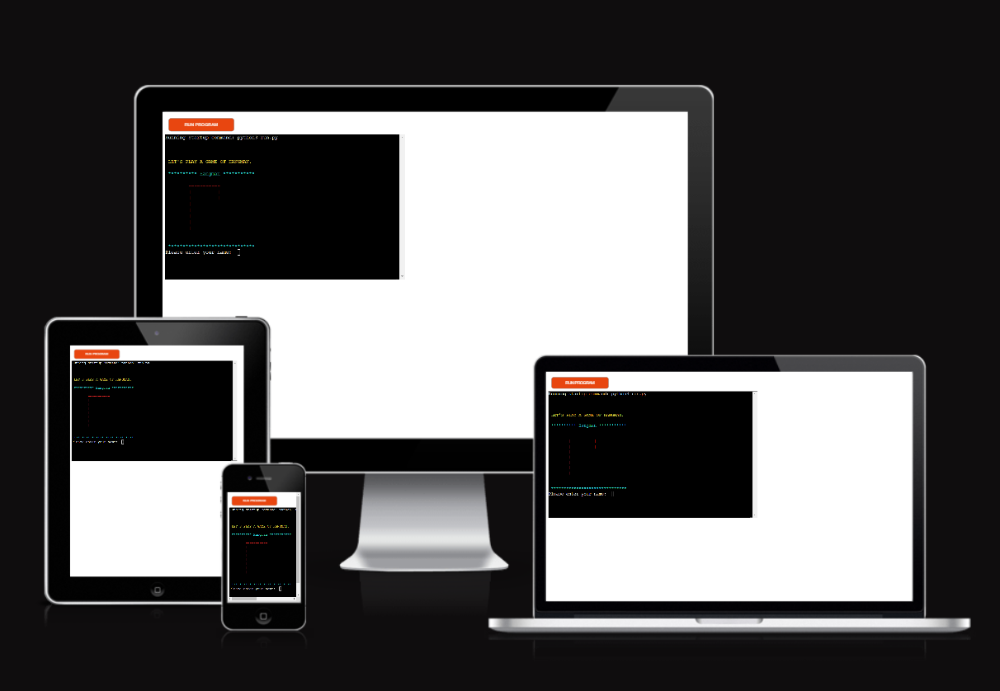
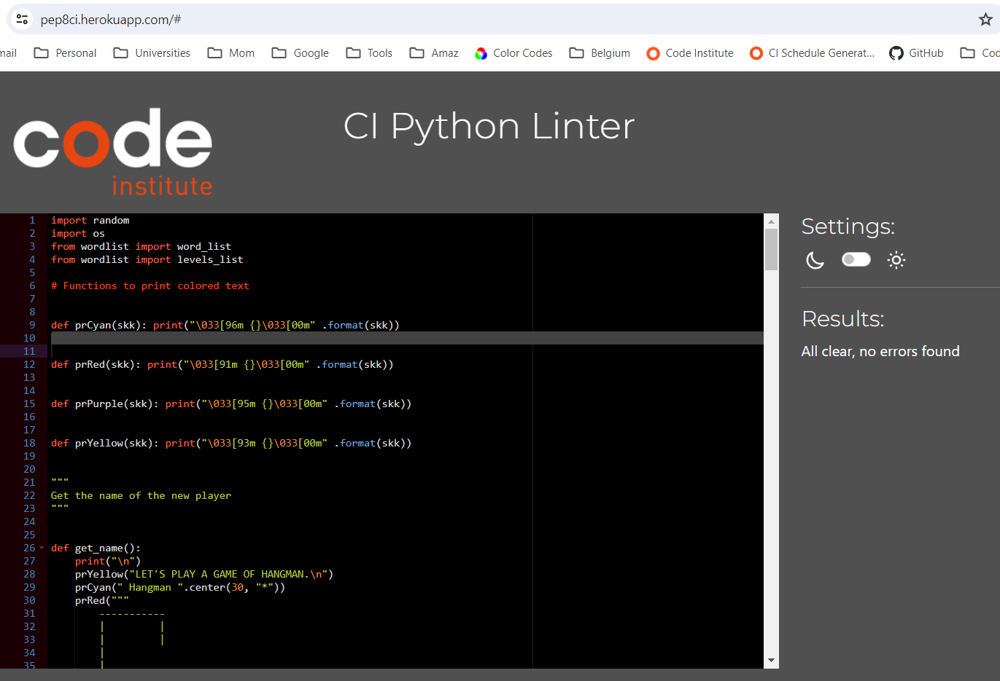

# hangman-word-game
Hangman-word-game  is a command-line application built with Python that hosts the word game, Hangman.  The game has three difficulty levels and is loaded with over 1000 words. 

[Here is the live version of my project.](https://hangman-word-game-f5f390685594.herokuapp.com/)

## Screenshots

## Planning the design
Hangman-word-game is a command-line application so the display is basic. The intention was to deliver an old-school, computer-game look, like Space Invaders or Pong, but with color.  

## Color Scheme
Colors were utilized, as displayed below, by adding functions to call particular color named functions to execute the relevant ANSI Escape Sequence (source: *https://www.geeksforgeeks.org/print-colors-python-terminal/*)
* def prRed(skk): print("\033[91m {}\033[00m" .format(skk)) was used on the start screen to show the gallows and to display the losing hangman score of 6 wrong out of 6.
* def prYellow(skk): print("\033[93m {}\033[00m" .format(skk)) was used for the start screen, "Let's play Hangman" and also to show error messages throughout the game so they would easily be seen.
* def prCyan(skk): print("\033[96m {}\033[00m" .format(skk)) was used as a basic color alongside white to provide an offset to all white text
* def prPurple(skk): print("\033[95m {}\033[00m" .format(skk)) was used on the win-screen

## Features
### Existing

| Feature | Description | Screenshot  | Screenshot  
|-------- | ----------- | ---------- | ---------- 
|Colors | As described above, colors were used to make the display more interesting and to utilize the tools in Python. |  |   
Personalization | On the start screen the user is asked their name and it is displayed throughout the program and used in the messages, including when the player chooses to play again after they finish their game. |  | 
|Difficulty Levels | The user can choose from three difficulty levels, 1 - Easy, 2 - Intermediate and 3 - Difficult.|  | 
|Play Again or Quit | When the game is over the user can choose to play again or quit. |  
|Validation and Error Messages | Every instance of user input, except for the name input (because a name could be anything, such as R2D2) is validated.  When user input is not valid, an error message appears with an invitation to re-enter the answer |  |  
|Instructions and information | At the beginning of the game simple instructions are displayed with how many errors can be made bbefore losing. Another message explains how many letters are in the secret word. |  |
|Hangman Displays | The Hangman displays the progression of the game with each error and shows how many errors have been made out of the total allowed of six. |  |  
|Letters already chosen section | Letters that have already been chose appear below the hangman display so the user can see what they've already chosen. If the user chooses the same letter twice, an invalid input message will appear and they can re-enter. This does not count as an wrong answer |   |   
|Win and loss screens| The end of game is marked with a splash of color on the win and loss screens with the invitation to either play again or quit the game |  |  

### Future Features
Hangman-word-game has room to grow
* Add more words
* Add word lists by subject in which user can choose
* Add easier or more difficult levels
* Add difficulty levels by words with a specific number of letters 

## Tools and Technologies Used

* Python to create the game
* Github to create, store and manage the game
* Heroku to deploy the game
* Random Module for the random choosing of the Hangman word from the word list
* OS Module for clearing the screen of the console

## Validator Testing

| Page | Language | Validator | Outcome | Screenshot |
| ---- | -------- | --------- | ------- | ---------- |
| https://hangman-word-game-f5f390685594.herokuapp.com/  (run.py)| Python |[PEP8 Python Validator](https://pep8ci.herokuapp.com/#)  | No errors found. | |

## Unfixed Bugs
There are no unfixed bugs.

## Deployment
The site was deployed to Heroku with the following steps:
1. Sign up for Heroku account
2. Create a new App and name it a unique name
3. Complete Settings section
    * Add Config Vars, add key PORT with value 8000
    * Add Python Buildpack and NodeJS Buildpack, in that order
4. Go to Deploy section, select Github and confirm, choose the hangman repository, click connect to link Heroku to the Github repository code
5. Click Enable Automatic Deploys
6. Wait for the message, "Your app was successfully deployed" then click VIEW

The live link can be found here: https://hangman-word-game-f5f390685594.herokuapp.com/

## Credits
The following are sources of information used in building Quiz - Fun

### Content, Code and Media
| Source | Location | Notes |
| ------ | -------- | ----- |
| [geeksforgeeks.org](https://www.geeksforgeeks.org/print-colors-python-terminal/) | Python | Print Colors in Python terminal - Method 3: Print Color Text using ANSI Code in Python, used throughout 
| [geeksforgeeks.org](https://www.geeksforgeeks.org/clear-screen-python/) | Python | How to clear screen in python?, used throughout the program to keep display visually pleasing
| [w3schools.com](https://www.w3schools.com/python/ref_string_isalpha.asp) | Python | Python String isalpha() Method used to validate the guess in the play_game function
| [w3schools.com](https://www.w3schools.com/python/ref_string_isnumeric.asp) | Python | Python String isnumeric() Method used to validate choice of diffculty in choose_word function
| [w3schools.com](https://www.w3schools.com/python/python_howto_remove_duplicates.asp) | Python | How to Remove Duplicates From a Python List, used to create list of the correct letters in the secret word with no duplicates, in order to later compare to guessed correct letters list, in play_game function
| [learnpython.com](https://learnpython.com/blog/loop-over-multiple-lists/)|Python | Using the zip Function to Automatically Loop Over Multiple Lists, used to find and display the dashes and the correct guessed letters that represented the secret word
| [tutorialspoint.com](https://www.tutorialspoint.com/how-to-compare-two-lists-in-python#:~:text=Using%20list.,of%20elements%20in%20the%20list) | Python | How to compare two lists in Python? - Using list.sort() and == operator, used to compare the correct letters list with the guessed correct letters list, in play_game function
| [adamj.eu](https://adamj.eu/tech/2022/11/04/why-does-python-deprecationwarning-invalid-escape-sequence/)| Python | Solved error for using slash(\) in the hangman print statements, by adding r before the quotations  
| [codeguage.com](https://www.codeguage.com/courses/python/strings-string-padding) | Python | Centering strings, used for start screen, hangman displays and win and loss displays
| [peps.python.org/](https://peps.python.org/pep-0008/#:~:text=spaces%20for%20indentation.-,Maximum%20Line%20Length,be%20limited%20to%2072%20characters) | Python | Maximum Line Length - help with resolving space errors in PEP8 Python Validator 
|[kite.com](https://youtu.be/m4nEnsavl6w?si=32eWJZP4K3RDIuu_) |Python |How to build HANGMAN with Python in 10 MINUTES, help with broad logic sequence

### Acknowledgements
* Thank you to [Chris Quinn](https://github.com/10xOXR), my mentor at Code Institute.
