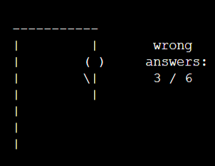

# Hangman-word-game
Hangman-word-game  is a command-line application built with Python that hosts the word game, Hangman.  The game has three difficulty levels and is loaded with over 1000 words. 

## Planning the design
Hangman-word-game is a command-line application so the display is basic. The intention was to deliver an old-school, computer-game look, like Space Invaders or Pong, but with color.  

## Color Scheme
Colors were utilized, as displayed below, by adding functions to call particular color named functions to execute the relevant ANSI Escape Sequence (source: *https://www.geeksforgeeks.org/print-colors-python-terminal/*)
* def prRed(skk): print("\033[91m {}\033[00m" .format(skk)) was used on the start screen to show the gallows and to display the losing hangman score of 6 wrong out of 6.
* def prYellow(skk): print("\033[93m {}\033[00m" .format(skk)) was used for the start screen, "Let's play Hangman" and also to show error messages throughout the game so they would easily be seen.
* def prCyan(skk): print("\033[96m {}\033[00m" .format(skk)) was used as a basic color alongside white to provide an offset to all white text
* def prPurple(skk): print("\033[95m {}\033[00m" .format(skk)) was used on the win-screen

## Features
### Existing

| Feature | Description | Screenshot  | Screenshot  
|-------- | ----------- | ---------- | ---------- 
|Colors | As described above, colors were used to make the display more interesting and to utilize the tools in Python. |  |   
Personalization | On the start screen the user is asked their name and it is displayed throughout the program and used in the messages, including when the player chooses to play again after they finish their game. |  | 
|Difficulty Levels | The user can choose from three difficulty levels, 1 - Easy, 2 - Intermediate and 3 - Difficult.|  | 
|Play Again or Quit | When the game is over the user can choose to play again or quit. |  
|Validation and Error Messages | Every instance of user input, except for the name input (because a name could be anything, such as R2D2) is validated.  When user input is not valid, an error message appears with an invitation to re-enter the answer |  |  
|Instructions and information | At the beginning of the game simple instructions are displayed with how many errors can be made bbefore losing. Another message explains how many letters are in the secret word. |  |
|Hangman Displays | The Hangman displays the progression of the game with each error and shows how many errors have been made out of the total allowed of six. |  |  
|Letters already chosen section | Letters that have already been chose appear below the hangman display so the user can see what they've already chosen. If the user chooses the same letter twice, an invalid input message will appear and they can re-enter. This does not count as an wrong answer |   |   
|Win and loss screens| The end of game is marked with a splash of color on the win and loss screens with the invitation to either play again or quit the game |  |  